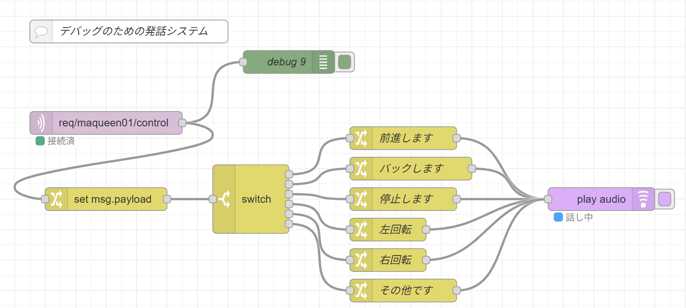

### a Maqueen driver and sample sources
- A driver and test programs for DFRobot micro:Maqueen (V4.0)
- I replaced the control board for Maqueen from micro:bit to XIAO-ESP32-S3.

for debug 

### references
- schematics 
  - https://macsbug.wordpress.com/2021/12/
- sample driver
  - https://github.com/kd8bxp/micro-Maqueen-Arduino-Library/blob/master/src/Maqueen.cpp   
